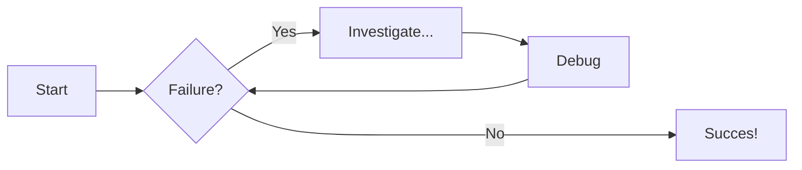

# Welcome to MkDocs

For full documentation visit [mkdocs.org](https://www.mkdocs.org).

## Commands

* `mkdocs new [dir-name]` - Create a new project.
* `mkdocs serve` - Start the live-reloading docs server.
* `mkdocs build` - Build the documentation site.
* `mkdocs -h` - Print help message and exit.

## Project layout

    mkdocs.yml    # The configuration file.
    docs/
        index.md  # The documentation homepage.
        ...       # Other markdown pages, images and other files.

yang terbaik intinya
drink :beers: and :soccer:

```cpp title="hello.cpp", linenums="1", hl_lines="4 6"
include<iostream>
using namespace std;

int main() {
    cout << "Hello kawan" << '\n';
    return 0;
}
```

## data baru

=== "Linked list"
    ini linked list

=== "Linked forward list"
    ini adalah linked forward list

=== "Ini adalah ciruclas linked list"
    Halo, ini jendela yang berbeda

## semoga bisa

??? info "yang baru saja terjadi"

    aku tidak tahu apakah ini bisa atau tidak, tapi semoga bisa

## flowchart
